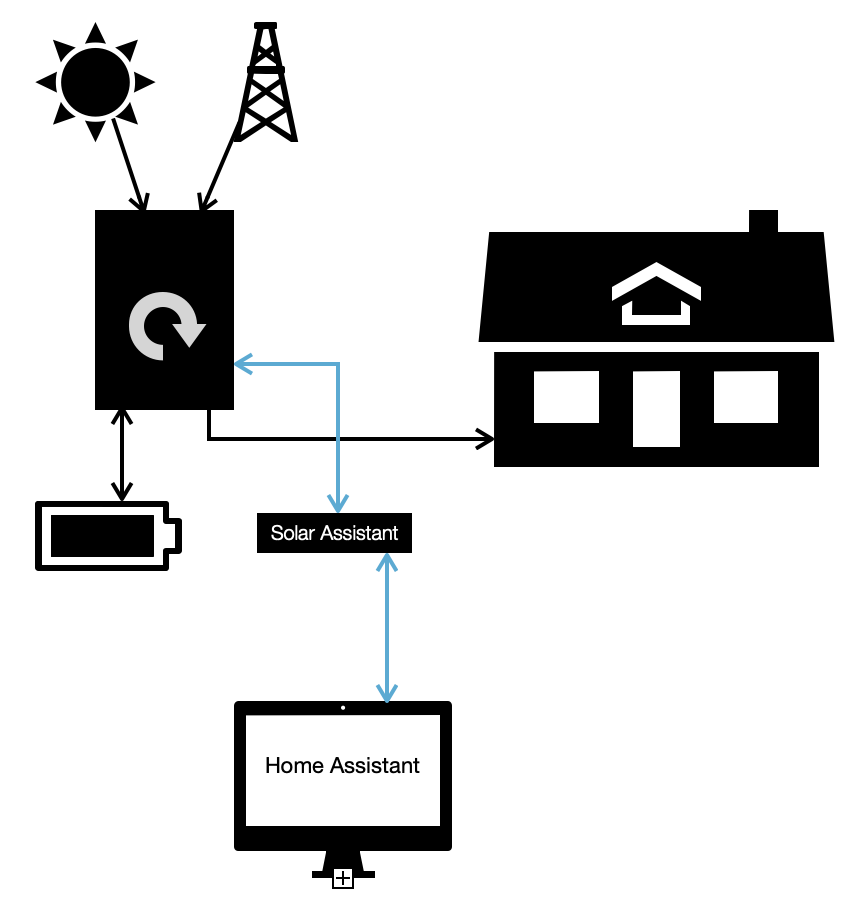

# GRIST, the Grid Boost Scheduler for Home Assistant

**GRIST** helps Home Assistant users minimize grid electricity costs by intelligently managing battery charging and solar usage in homes equipped with solar panels and battery storage.

The scheduler automatically determines how much to charge the battery during off-peak hours, aiming to avoid grid usage during expensive peak times. It adapts to changing weather and load conditions using solar forecasts and historical consumption data, and provides manual override options for special circumstances.

**NOTE: Version 1.0.0 only works with batteries that are managed by State of Charge (not voltage).** Subsequent versions may include manage voltage levels instead of state of charge. Let me know if this is important to you.'

**Be Aware**: Installing this integration and setting the mode to either Automatic or Manual will turn On the Time of Use feature in your inverter.

## Pros and Cons

Pros:

- You will use signficantly less energy from the Grid and your energy bills will be lower.
- You will have a good idea how long your battery charge will run your loads.

Cons:

- You won't have a great excuse to buy more batteries.
- You need a specific brand of inverter.[^brands]
- You need to buy and install Solar Assistant.
- You will have to take some time to set this up.

[^brands] Currently, only Sol-Ark (Deye-based) inverters are supported. Why? That is the inverter I own. I just don't have access to other inverters to test. Support for additional inverter brands may be added in future releases. Let me know if there is interest.

## Features

- **Automatic Grid Boost Calculation:**
  Calculates the required battery State of Charge (SoC) for off-peak charging based on solar forecasts, historical load, and PV performance.
- **Manual Override:**
  Allows users to manually set the grid boost SoC target for unusual conditions like snow covering your panels.
- **PV Forecast Integration:**
  Allows you to select any of three alternative PV forecasting integrations, and automatically adjusts solar production forecasts based on actual PV performance.
- **Historical Data Integration:**
  Tracks and averages load and PV production using Home Assistant sensors in order to optimize calculations as seasonal changes occur or system changes are introduced.
- **Battery and PV Monitoring:**
  Self-adjusts to the addition or removal of battery and PV capacity.
- **Custom Sensors:**
  Exposes calculated values and statistics as Home Assistant sensor entities so you can display key information on your dashboards.
- **Configurable Options:**
  All key options (modes, off-peak start and stop hours, SoC targets, forecast update hour, history days, minimum SoC) are configurable via the normal Home Assistant configuration process.
- **Extensible Forecast Support:**
  Supports multiple forecast providers: [Solcast](https://github.com/BJReplay/ha-solcast-solar), [Forecast.solar](https://forecast.solar/),and [Meteo](https://github.com/rany2/ha-open-meteo-solar-forecast). (Solcast and Meteo require installing custom integrations using HACS.)
- **Multiple modes:**
  Supports the following modes: *Automatic*, *Manual*, *Testing*, and *Off*. *Automatic* mode manages grid boost daily. *Manual* mode allows you to set a specific boost amount, which could be helpful for days when you know your usage will signficantly differ from your normal patterns of use (or when you know your panels will be covered with snow and produce little power even though the forecast expects sun). *Testing* mode allows you to watch what the system will do, but will not actually change the Time of Use settings of your inverter. *Off* operates similar to *testing*, but also will turn off the time of use setting on your inverter.
- **Low overhead:**
  The system is designed to minimize the use of system resources.

## How It Works

Basically the system monitors PV forecasts, and compares forecasts to actual PV performance and actual loads in order to calculate the optimal state of charge that the battery should have to carry you through the day with minimal grid use during the higher grid rates.

Sol-Ark (Deye) inverters allow you to set six Time of Use slots where your battery will charge from the grid if the state of charge drops below the set value for that time slot. This integration sets the starting time of the first time slot (defaults to midnight) and sets the inverter state of charge setting for that period based on either the calculated (*automatic*) value, or the value you set for the *manual* mode. The grid boost will stop at the start of the second slot. This defaults to 6am.

Solar Assistant, a Raspberry Pi based tool to monitory your solar system, provides both the data to this integration as well as a means to control the inverter settings. (Earlier verions of this integration used data from the deye (and later solark) cloud servers, however that proved signficantly less reliable.)

I have found that the performance of my solar panels varies from season to season and year to year. Panels will slowly degrade. Some years have more dust on the panels than other years. During the spring my panels have more morning shade than during the summer. All these changing factors affect performance and how much power I need from the grids. This integration takes those changes into account and adjusts grid boost based on those changes!

### Data Collection and Forecasting

- **Solar Forecasts:**
  GRIST fetches hourly solar production forecasts from supported APIs. These are updated just a few times each day but particularly past midnight local time, and at a configurable hour (default: 22:00 local time). The midnight forecast is focused on historical performance calculation accuracy and the user-configurable hour is focused on calculations for the next day boost setting.

- **PV History:**
  GRIST tracks a rolling 21 day history of PV forecasts to compare forecasts to actual performance. This allows for more precise automatic adjustments of forecasts specific to your system, local shading, etc.

  **Load History**
  GRIST monitors recent load usage for each hour of the day, computing averages for each hour so that it can calculate how your battery will likely perform through the coming day given the forecast for solar power and the actual recent performance of your panels. As user, you can set how many days of history you want to use to calculate load averages (1-10).

### Calculations

- **Required Boost Calculation:**
  Each day, the scheduler compares the adjusted solar forecast for tomorrow with the average load for each hour. It calculates the net deficit (when load exceeds PV) and determines the required battery boost percentage to cover expected shortfalls. This minimum requirement is added to a "buffer" (minimum state of charge) that you set so that there is always some reserve for those days when extra consumption occurs.

- **Automatic PV Forecast Adjustment:**
  The forecasted PV for tomorrow is adjusted using the ratio of actual to forecast PV from the past 21 days, improving accuracy. This is important if you have shaded conditions during parts of the day, or if you have (for example) some panels facing east and some facing west. Most free teir forecasts do not allow you to specify multiple panel arrays, but the ratio is an elegent solution to account for this situation.

  **Note**: The Forecast_Solar integration uses the solar panels that you specify in the Energy configuration dashboard. This does allow you to specify separate south-facing vs east-facing panels, for example. Due to the automatic PV forecast adjustment, you probably do not need to actually list all the different panels. Just list your total PV array capacity and let the automatic feature figure how it actually performs for each hour of each day.

### Sensors Exposed

- **Actual Grid Boost SoC:**
  Actual grid boost setting for time of use slot 1 on your inverter.

- **Calculated Grid Boost SoC:**
  Automatically calculated grid boost target for off-peak charging. (Only used in the automatic mode.)

- **Manual Grid Boost SoC:**
  Manually value for grid boost. (Only used when in the manual mode.)

- **Battery Time Remaining:**
  Estimated hours of battery power remaining. This is based on the current state of charge, expected PV generation, and the average hourly loads that you should see.

- **Estimated PV Power:**
  Current hour estimated PV power output as adjusted based on your system performance. (This will probably be different from the raw forecasted PV power for this hour.)

- **Scheduler Entity:**
  Summarizes the current mode (automatic/manual), boost settings, load history days, and forecast values.

- **Load Entity:**
  Presents the average hourly load over the selected history period.

- **PV Ratio Entity:**
  Presents the calculated shading/extra ratio for each hour, based on PV performance.

## Configuration

### Initial Setup

**Prerequisites:**
  To use the integration, you must have:

- a Sol-Ark (or Deye based) inverter,
- an LFP (Lithium Iron Phosphate, or LiFePo4) battery that is able to report it's state of charge to the inverter,
- Solar Assistant monitoring your inverter and batteries, with MQTT turned on and reporting real-time data
- Home Assistant,
- network connection between Solar Assistant and your Home Assistant systems
- the MQTT integration installed on Home Assistant and pointing to Solar Assistant as the MQTT broker.

In addition you must install one of three solar forecaster tools:

- [Solcast]([https://solcast.com](https://github.com/BJReplay/ha-solcast-solar)
- [Forecast.solar](https://forecast.solar/)
- [Meteo](https://github.com/rany2/ha-open-meteo-solar-forecast)

(If you install more than one, they will be selected in the order presented above.)

I use the Solcast tool because I like the unique feature it offers of allowing you to decide how pessimistic (or optimistic) you want the forecast to be. Solcast give a 10 percentile forecast (worst case), a 50 percentile forecast (most likely) and a 90% forecast (best case). When heavy but intermitted clouds are forecast, the spread between 10 and 90 percentile can be quite large. GRIST extrapolates those forecasts so you can choose any percentile you want between 10 and 90. Since I am optimizing to avoid using the grid after 6am, I normally use a 25 percentile figure. (I'm not TOTALLY pessimistic!!!)

**Install the Integration:**
   TODO: HACS installation instructions and link to page

**Configure Options:**
   Set your preferred options via the integration options panel. For the system to actually control the inverter and set your early morning grid boost level, you must set the integration into *Automatic* mode.

### Options

- **Boost Mode:**
  Select between automatic, manual, off, or testing. The default is testing.
- **Manual Grid Boost (%):**
  Set the manual grid boost value as a percentage. This is used only when in Manual mode. The default is 50%.
- **Grid Boost Start Time:**
  Set the time to start grid boost. (The default is 00:02 - two minutes past midnight).
- **Update Hour:**
  Set the hour of the day to run the calculations and update the inverter Time of Use setting (0-23, the default hour is 22, which is 10pm local time).
- **Days of Load History:**
  Number of days of load history to use for calculations, a number between 1 and 10. The default value is 4 days. If your weather quickly, you may want to set this shorter. If your weather is more stable, you may want to set it longer. Weekdays and weekend days are treated the same.
- **Minimum State of Charge (%):**
  Set the minimum battery SoC value. This is the buffer so your battery does not run down to 0% state of charge. The default is 20%.

## Removal

To remove GRIST, Go to Settings/Devices & Services/GRIST. Using the three vertical dots next to CONFIGURE, select DELETE from the drop down menu.

If you want to turn off the Time of Use feature on your inverter, you should first click on the CONFIGURE button and set the Boost Mode to Off. You will need to confirm that choice, continue on to the details form, and Save. This will turn off the Time of Use mode through Solar Assistant. You can then remove GRIST.

## Notes

I think that the best forecaster is the one that uses Solcast data. If you want to use this forecaster, follow the instructions in the [Solcast](https://github.com/BJReplay/ha-solcast-solar) custom integration. You will need to register for a free Solcast api key to use this forecaster.

As mentioned above, there are six Time of Use slots in a Deye (Sol-Ark) inverter. GRIST turns on the Time of Use feature, manages slot 1 start time and state of charge value, and sets the start time of slot 2. (Your inverter will also let you set the power level used from the grid. GRIST does not that.)

The inverter requires all slots to be set in order to use the Time of Use feature, and will have default values. You may change the values in slots 3-6 as you desire. Remember that this integration does manage the time value for slot 2. Be sure to read your inverter documentation before making changes.

The inverter Time of Use feature allows you to set the days when Grid charging will take place. This is not accessable through Solar Assistant. The inverter will default to turn on all days. (GRIST is designed with the assumption that charging will happen every day.)

If you use the other slots, I recommend setting the values to a very low number such as 2-5% so that your battery can use as much of the capacity it has instead of pulling from the grid.

TIP: Early on I had a pretty small solar panel array. There were days when I couldn't charge my battery enough before my peak electricity rates (4-8pm). I wanted to make sure that I never used grid power from 4-8pm. While I set slots 2,4,5 and 6 to 4%, I set the 3rd slot start one hour before the peak rate hour and boost, if neccesary, the battery to 45% by 4pm. This ensured that I always had enough power to get me through my peak-cost grid energy period by running only on my battery.

## File Structure

- `__init__.py` – Integration setup and teardown logic
- `config_flow.py` – UI configuration and options flow
- `const.py` – Shared constants and enums
- `coordinator.py` – Update coordinator for polling and data refresh
- `daily_calcs.py` – Daily calculation logic for PV/load/boost
- `entity.py` – Entity base classes and helpers
- forecasters/`forecast_solar.py`, `solcast.py`, `meteo.py` – Forecast provider modules
- `grist.py` – Main scheduler and calculation logic
- `sensor.py` – Sensor entity definitions
- `services.yaml` – Service definitions
- translations/`en.json` – UI translation strings

## Contributing

Contributions are welcome! Please follow the code style and patterns used in this repository. (I strive to follow best practices used within the Home Assistant community.)

## License

This project is licensed under the terms of the GNU GENERAL PUBLIC LICENSE. See `LICENSE` for details.
